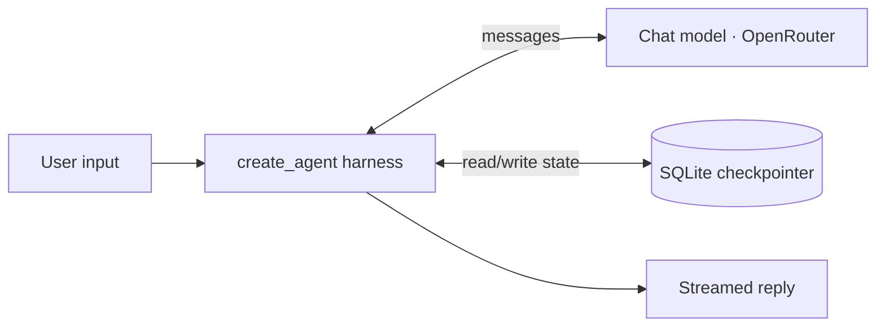

# Architecture

Living description of what exists in Sapiens today. Each module updates its own section as
it lands. For the product vision see the [README](../README.md); for specific decisions see
the [ADRs](decisions/README.md).

## Embedded model

Sapiens is an embedded copilot: it runs **inside a host app** (the demo host is Acme
Analytics) as a chat widget, and reaches the host's services over MCP. The standalone CLI
is a development convenience, not the product.

## Module status

| # | Module | Capability | Status |
|---|--------|-----------|--------|
| M1 | Foundation — agent kernel, tool registry, persistence, streaming, CLI | infra | ✅ Done |
| M2 | Middleware Stack — composition seam + tool-call patching | infra | ✅ Done |
| M3 | Knowledge — semantic layer + Text-to-SQL + doc RAG | Know | ⬜ Planned |
| M4 | Understanding — context, identity, intent | Understand | ⬜ Planned |
| M5 | Reasoning — routing, sub-agents, synthesis | Reason | ⬜ Planned |
| M6 | HITL — declarative per-tool approval gates | safety | ⬜ Planned |
| M7 | Action — MCP host integration | Act | ⬜ Planned |
| M8 | Adaptation — memory + summarization | Adapt | ⬜ Planned |
| M9 | Host shell + chat widget | infra | ⬜ Planned |
| M10 | Integration signature workflow | all | ⬜ Planned |
| M11 | Eval + Deploy | infra | ⬜ Planned |

## M1 — Foundation

A minimal `create_agent` harness that answers from the model, streams to the terminal, and
persists each conversation by `thread_id` across turns and restarts. No business tools yet —
M1 ships the wiring that later modules plug into.

### Flow



### Key files

| File | Role |
|------|------|
| [`config.py`](../src/sapiens/config.py) | `Settings` + `Settings.from_env()` — OpenRouter key, model, db path, temperature. |
| [`models.py`](../src/sapiens/models.py) | `build_model()` — initializes the chat model via the OpenRouter provider. |
| [`tools/registry.py`](../src/sapiens/tools/registry.py) | Process-wide tool registry: `register` / `get_tools` / `clear_registry`. Empty in M1. |
| [`agent.py`](../src/sapiens/agent.py) | `build_agent()` factory + `open_checkpointer()` ([ADR-0001](decisions/0001-sqlite-checkpointer-lifecycle.md)). |
| [`cli.py`](../src/sapiens/cli.py) | Streaming REPL (`sapiens` entry point). Commands: `/new`, `/exit`. |

### Run it

```bash
cp .env.example .env    # then add your OPENROUTER_API_KEY
uv run sapiens
```

## M2 — Middleware Stack

Cross-cutting behaviour layers around the model as `AgentMiddleware`. M2 establishes the
**composition seam** and the one piece with no built-in equivalent; everything else is a
reused LangChain v1 built-in added by its owning module. See
[ADR-0002](decisions/0002-middleware-reuse-over-rebuild.md).

### Key files

| File | Role |
|------|------|
| [`middleware/stack.py`](../src/sapiens/middleware/stack.py) | `build_middleware()` — the ordered stack passed to `create_agent`. Later modules append here. |
| [`middleware/patch.py`](../src/sapiens/middleware/patch.py) | `PatchToolCallsMiddleware` — answers dangling tool calls so a resumed thread stays valid (custom; built from primitives). |
